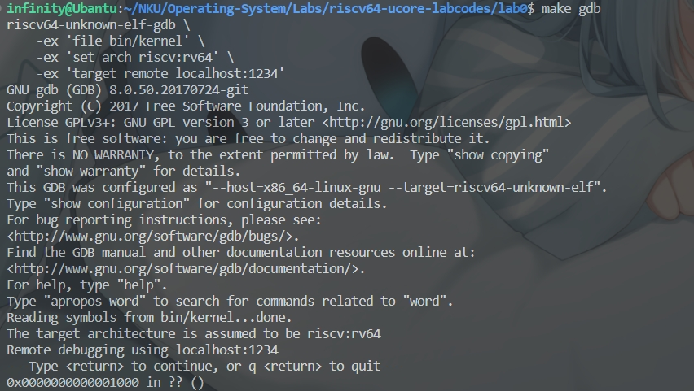
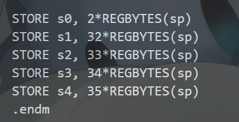
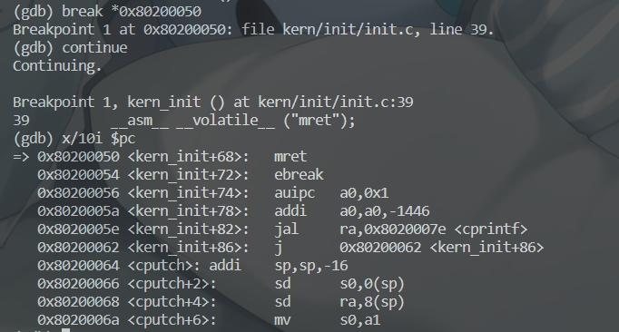
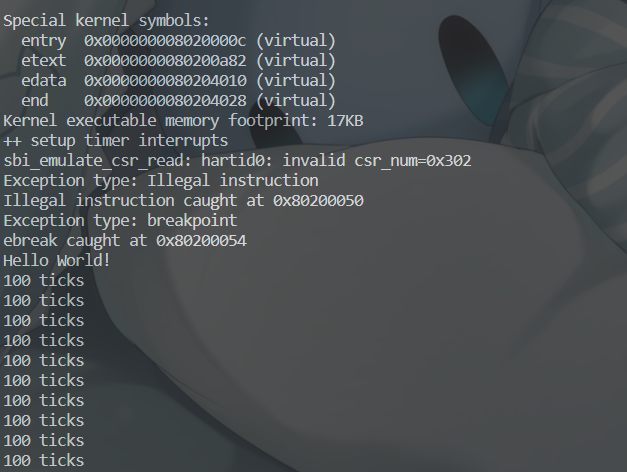

# 操作系统 Lab0.5 & Lab01 实验报告

> 小组成员：武桐西 2112515、胡亚飞 2111690、王祺鹏 2110608

## 练习 0.5：使用 GDB 验证启动流程

> 为了熟悉使用qemu和gdb进行调试工作,使用gdb调试QEMU模拟的RISC-V计算机加电开始运行到执行应用程序的第一条指令（即跳转到0x80200000）这个阶段的执行过程，说明RISC-V硬件加电后的几条指令在哪里？完成了哪些功能？要求在报告中简要写出练习过程和回答。

RISC-V 硬件加电后的指令位于 `0x00001000` 处，并将`pc`的地址初始化为该值。

> `0x00001000`是QEMU模拟的riscv处理器的复位地址，
因此处理器将从此处开始执行复位代码，复位代码主要是将计算机系统的各个组件（包括处理器、内存、设备等）置于初始状态。



加电后的指令：

```RISC-V
0x1000:      auipc   t0,0x0
0x1004:      addi    a1,t0,32
0x1008:      csrr    a0,mhartid
0x100c:      ld      t0,24(t0)
0x1010:      jr      t0
```

`0x1000`处的指令：将程序计数器（PC）的高 20 位偏移量设置为0x0，并将结果存储在寄存器 t0 中，这实际上是一个将全局地址的高位加载到寄存器的指令。

`0x1004`处的指令：将寄存器 t0 的值加上立即数32，并将结果存储在寄存器 a1 中

`0x1008`处的指令：将 mhartid 寄存器的值读取到寄存器 a0 中，mhartid 寄存器是 RISC-V 多核处理器中的一个特殊寄存器，用于表示当前硬件线程的标识符

`0x100c`处的指令：load double words，从地址为 t0 加上 24 的内存位置处加载一个双字（64 位）的值，并将结果存储在寄存器 t0 中，那个地址保存的数据就是0x80000000

`0x1010`处的指令：无条件跳转到寄存器 t0 中存储的地址

此后，`pc`即跳转到了0x80000000处，开始执行内核代码（即`entry.S`中的代码），如下所示。

最后通过尾调用 `tail` 跳转到 `kern_init` 函数处（即 `0x80200000`处），开始执行内核初始化代码。

## 练习 1：理解内核启动中的程序入口操作

> 阅读 kern/init/entry.S内容代码，结合操作系统内核启动流程，说明指令 la sp, bootstacktop 完成了什么操作，目的是什么？ tail kern_init 完成了什么操作，目的是什么？

- `la sp,bootstacktop`：

  - `la`是 Load Address 指令，将 `bootstacktop`的地址加载到栈指针寄存器 `sp`中。
  
  - **目的**是设置内核的初始栈指针，确保在内核执行期间可以正常使用栈。

- `tail kern_init`：
  
  - `tail`是一个**尾调用**汇编指令，它的作用是将当前函数的控制流转移到另一个函数，同时不会在调用栈中添加新的帧。`tail kern_init`的作用是将控制流转移到`kern_init`函数，在当前函数结束后，继续在函数 `kern_init`处继续执行，同时不会在调用栈中添加新的帧（也就是说也不必保留当前函数的调用信息），不影响 `sp`。这个指令通常用于在函数调用之间进行跳转，以便在调用栈中保持较少的帧，从而减少内存的使用。
  
  - **目的**是启动内核初始化函数 。`tail`表示将程序的控制权转移到名为`kern_init`的函数的起始地址，而不会返回到`kern_init`函数被调用的位置。这种尾调用的使用可以提高程序的效率，减少函数调用的开销。`kern_init()`初始化完成后，内核可以开始执行其他任务。

## 练习 2：完善中断处理

> 请编程完善trap.c中的中断处理函数trap，在对时钟中断进行处理的部分填写kern/trap/trap.c函数中处理时钟中断的部分，使操作系统每遇到100次时钟中断后，调用print_ticks子程序，向屏幕上打印一行文字"100 ticks"，在打印完10行后调用sbi.h中的shut_down()函数关机。

> 要求完成问题1提出的相关函数实现，提交改进后的源代码包（可以编译执行），并在实验报告中简要说明实现过程和定时器中断中断处理的流程。实现要求的部分代码后，运行整个系统，大约每1秒会输出一次"100 ticks"，输出10行。

完善代码的主要部分如下：

```C
/* LAB1 EXERCISE2   2112515、2111690、2110608 */
clock_set_next_event(); // 设置下次时钟中断
ticks++; // 计数器加一
if (ticks % TICK_NUM == 0) { // 每当计数器加到100的时候
    print_ticks(); // 我们会输出一个`100ticks`表示我们触发了100次时钟中断
    num++; // 同时打印次数（num）加一
    if (num == 10) { // 判断打印次数，当打印次数为10时
        sbi_shutdown(); // 调用<sbi.h>中的关机函数sbi_shutdown()关机
    }
}
```

- **实现过程：**
  首先调用 `clock_set_next_event()`函数，该函数在文件`clock.c`中定义，设置下次时钟中断时间，并为当前时间加上`timebase`（100000）。随后计数器 `ticks`加 1，每当 `ticks`加到 100 时，就调用 `print_ticks`打印"100 ticks"，同时打印次数 `num` 加 1。在打印次数 `num`达到 10 后，调用 `sbi.h` 中的 `sbi_shutdown()` 函数关机。

- **定时器中断处理的流程：**

  - 在定时器中断时，首先跳转到 CSR `stvec` 保存的地址（由于采用 `Direct` 模式，`stvec` 直接存着中断处理程序的入口点地址，即 `trapentry.S` 中的 `__alltraps`处）继续执行。

  - 随后先进行上下文 `context` 的保存（由汇编宏 `SAVE_ALL` 定义），再通过 `move a0, sp` 将栈指针寄存器 `sp` 的内容保存到 `a0` 中(`a0` 寄存器传递参数给接下来调用的函数 `trap`，`trap`函数定义在 `kern/trap/trap.c` 中)，然后跳转到 `trap` 处继续执行。

  - 在 `trap.c` 中的中断处理函数 `trap_dispatch`，判断时钟中断是（外部）中断，于是调用 `interrupt_handler()`处理中断。

  - 在 `interrupt_handler()`中，根据 `cause`的值，跳转到 `IRQ_S_TIMER`处继续执行。

  - 随后的处理过程如上述代码所示。

## 扩展练习 Challenge1：描述与理解中断流程

> 回答：描述 ucore 中处理中断异常的流程（从异常的产生开始），其中mov a0, sp的目的是什么？SAVE_ALL中寄存器保存在栈中的位置是什么确定的？对于任何中断，__alltraps 中都需要保存所有寄存器吗？请说明理由。

**处理中断异常的流程：**

- 产生异常时首先跳转到寄存器`stvec`保存的地址执行指令。在内核初始化时将`stvec`的值设为`__alltraps`处的地址，因此会跳转到`trapentry.S`中的`__alltraps`标签处执行。

- 在`__alltraps`处调用`SAVE_ALL`函数，对上下文`context`进行保存，然后执行`move a0,sp`，将栈指针寄存器`sp`中的内容保存到`a0`寄存器中，紧接着跳转到`trap`处继续执行。

- 中断处理函数`trap_dispatch`，判断本次异常事件是中断还是异常。通过判断`(intptr_t)tf->cause < 0`，判断`tf->cause`的最高位是否为1，如果是1，则说明是由中断引起的；否则，说明是异常。
如果是中断，则调用`interrupt_handler(tf)`函数进行中断处理。如果是异常，则调用`exception_handler(tf)`函数进行异常处理。

**`move a0,sp`的目的：**`a0`是用来存储函数参数的寄存器。`trap`函数只有一个参数，这个参数是指向一个结构体的指针，因此需要将`sp`中的内容，也就是结构体的首地址，赋值给`a0`，并由`a0`传递给`trap`函数。

**`SAVE_ALL`中寄存器保存在栈中的位置是由什么确定的？** 由原来的栈指针 `sp` 确定（`sscratch` 寄存器）；由于之后 `sp` 的值会被修改，因此在这之前会将 `sp` 的值保存在 `sscratch` 寄存器中，它记录的即为内核栈地址。

**对于任何中断，`__alltraps`中需要保存所有寄存器吗：**
为了操作的方便性（封装为结构体，对所有中断采取统一的保存寄存器策略，会使操作更加便捷），可以保存所有 32 个通用寄存器以及相关 CSR 的值。

## 扩展练习 Challenge2：理解上下文切换机制

> 回答：在trapentry.S中汇编代码 csrw sscratch, sp；csrrw s0, sscratch, x0实现了什么操作，目的是什么？save all里面保存了sbadaddr、scause这些csr，而在restore all里面却不还原它们，那这样store的意义何在呢？

`csrw sscratch, sp` 汇编指令将当前栈指针 `sp` 的值写入到 `sscratch` 控制状态寄存器（CSR）中。因为我们约定，若中断来自 S-mode，则 `sscratch` 的值为 0；若中断来自 U-mode，则 `sscratch` 的值为内核栈地址。该步操作即为将内核栈地址赋值给 `sscratch`。

而 `csrrw s0, sscratch, x0` 汇编指令将 `sscratch` CSR 的值读取到 `s0` 寄存器中，并将 `x0` 寄存器的值写入到 `sscratch` CSR 中，即将`sscratch`清零。

`csrw sscratch, sp` 这个操作的目的是将当前栈指针保存到 `sscratch` CSR 中，因为后续的操作 `addi sp, sp, -36 * REGBYTES` （为保存 context 预留出空间）会改变当前`sp`的值。

而 `csrrw s0, sscratch, x0` 操作的目的是将 `sscratch` CSR 的值（此时保存的值即为原栈指针`sp`的值）保存到 `s0` 寄存器中，进而将其保存到之前开辟的栈帧空间中，多用到了个中间寄存器`s0`是因为 RISCV 不能直接从 CSR 写到内存, 需要先把 CSR 读取到通用寄存器，再从通用寄存器 `STORE` 到内存；与此同时，将 `sscratch` CSR 清零，目的是为了当嵌套中断发生时，异常向量能够知道中断来自内核。

在系统中`x2`一般存的是栈指针所以没有按照0，1，2，3，4而是将2空了出来最后`store`。



由于`sbadaddr`寄存器和`scause`寄存器中保存的分别是中断的地址以及中断的原因（如`if ((intptr_t)tf->cause < 0)`），当处理完这个中断的时候，也就不需要这两个寄存器中保存的值，所以无需恢复这两个寄存器。之所以需要`store`是因为在处理中断的过程中会用到这些 CSR 的值。

## 扩展练习 Challenge3：完善异常中断

可参见参见代码。主要代码如下：

```C
case CAUSE_ILLEGAL_INSTRUCTION:
    // 非法指令异常处理
    /* LAB1 CHALLENGE3   2112515、2111690、2110608 */
    cprintf("Exception type: Illegal instruction\n");
    cprintf("Illegal instruction caught at 0x%08x\n", tf->epc);
    tf->epc += 4; // 指令长度 4 字节
    break;
case CAUSE_BREAKPOINT:
    //断点异常处理
    /* LAB1 CHALLLENGE3   2112515、2111690、2110608 */
    cprintf("Exception type: breakpoint\n");
    cprintf("ebreak caught at 0x%08x\n", tf->epc);
    tf->epc += 2; // 指令长度 2 字节
    break;
```

在 `kern_init` 函数中增加一些指令，用以引发异常（非法指令异常和断点异常）：

```C
// 增加异常指令

// 非法指令
__asm__ __volatile__ ("mret");

// 断点
__asm__ __volatile__("ebreak");

// 打印信息
cprintf("Hello World!\n");
```

对于这两条用来触发异常的指令，其指令长度可以通过查阅 [《RISC-V指令集手册》](http://staff.ustc.edu.cn/~llxx/cod/reference_books/RISC-V-Reader-Chinese-v2p12017.pdf) 得知，`mret`指令的长度为 4 字节，`ebreak`指令的长度为 2 字节。
也可以通过 `gdb` 调试得知，如下图所示：



其中，`0x80200062 <kern_init+86>:   j       0x80200062 <kern_init+86>` 对应的即为 `kern/init/init.c` 中的 `kern_init()` 函数的死循环 `while (1);` 。

运行 `make qemu`，可以看到如下输出：



说明异常处理代码编写正确！

## 知识总结

### 关于`CSR`寄存器

CSR，即**控制状态寄存器** Control and Status Registers(CSRs)。

在中断机制中，有几个重要的CSR：

- `stvec`(Supervisor Trap Vector Base Address Register)：中断向量表基址，用来将不同类型的中断映射到对应的中断处理程序。

> 如果只有一个中断处理程序，一般`stvec`会直接指向那个程序的地址。

- `sscratch`：一般在处理用户态的中断时起作用。在S态时一般置为0，U态时会记录内核栈的地址。

- `sepc`(supervisor exception program counter)：它会记录触发中断的那条指令的地址。

- `scause`：它会记录中断发生的原因，还会记录该中断是不是一个外部中断。

- `stval`：它会记录一些中断处理所需要的辅助信息，比如指令获取(instruction fetch)、访存、缺页异常，它会把发生问题的目标地址或者出错的指令记录下来，这样我们在中断处理程序中就知道处理目标了。

### `csrw`、`csrrw` 和 `csrr` 指令

`csrw`、`csrrw` 和 `csrr` 都是 RISC-V 架构中的控制状态寄存器（CSR）操作指令，它们的作用和区别如下：

- `csrw` 指令用于将一个值写入到指定的 CSR 中，语法为 `csrw csr, rs1`，其中 `csr` 是 CSR 的地址或编号，`rs1` 是要写入到 CSR 中的源通用寄存器。

- `csrrw` 指令用于将一个 CSR 的值读取到一个寄存器中，并将一个值写入到该 CSR 中，语法为 `csrrw rd, csr, rs1`，其中 `rd` 是要将 CSR 写入的目的通用寄存器，`csr` 是 CSR 的地址或编号，`rs1` 是要写入到 CSR 中的源通用寄存器。

- `csrr` 指令用于将一个 CSR 的值读取到一个通用寄存器中，语法为 `csrr rd, csr`，其中 `rd` 是要将 CSR 写入的目的通用寄存器，`csr` 是 CSR 的地址或编号。

这三个指令的区别在于它们对 CSR 的读写操作不同：

- `csrw` 指令只能写入 CSR，不能读取 CSR 的值。

- `csrrw` 指令既可以读取 CSR 的值，也可以写入 CSR。

- `csrr` 指令只能读取 CSR 的值，不能写入 CSR。

因此，`csrw` 和 `csrrw` 指令可以用于设置和清除 CSR 的某些位，而 `csrr` 指令通常用于读取 CSR 的状态信息。

实际上，只有`csrrw`指令是真正的机器码指令 [*真正的机器码只有 6 条指令，分别为：`csrrw`、`csrrs`、`csrrc`、`csrrwi`、`csrrsi`、`csrrci`*] ，其他两个指令均为伪指令。
`csrw csr, rs1` 写 `rs1` 寄存器的值到 `csr` 中，相当于`csrrw zero, csr, rs1`。
`csrr rd, csr` 读 `csr` 寄存器的值到 `rd` 中，相当于`csrrs rd, csr, zero`。
