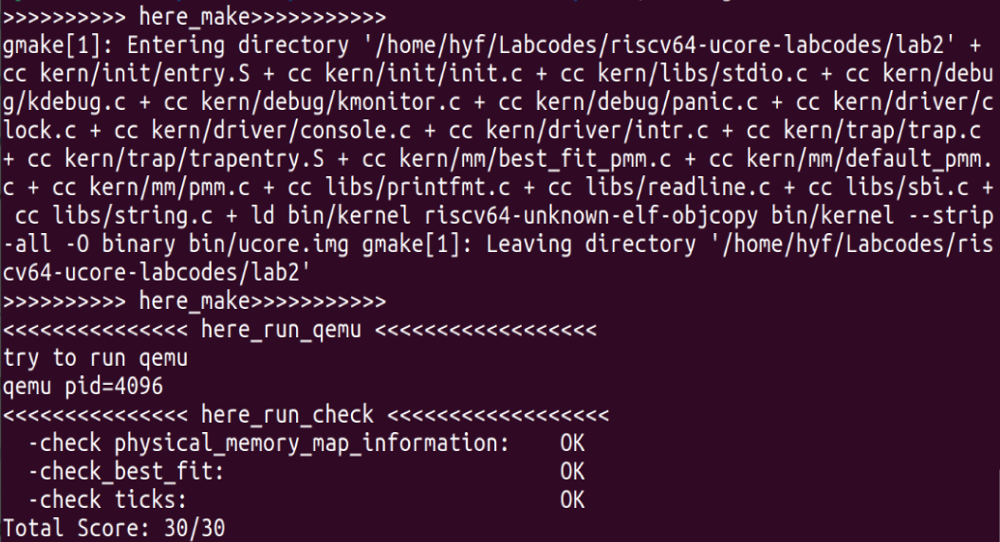
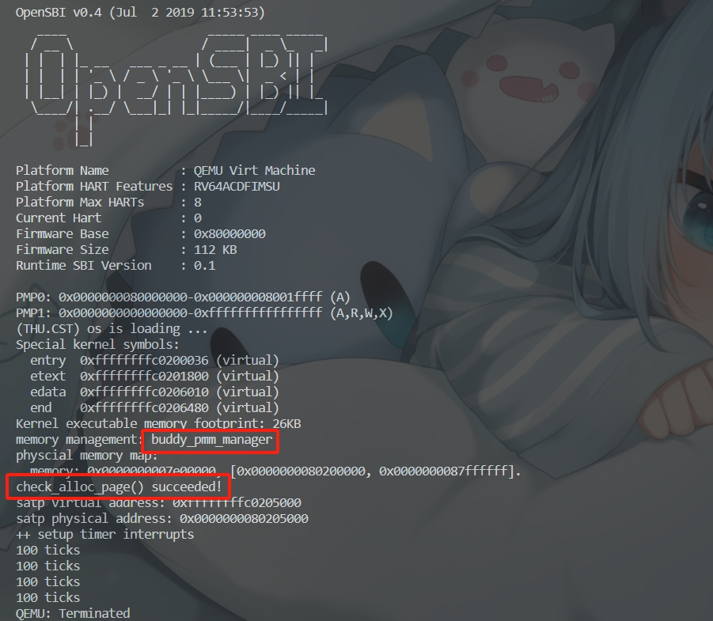

# **操作系统 Lab02 实验报告**

> 小组成员：武桐西 2112515、胡亚飞 2111690、王祺鹏 2110608

## **练习1：理解First-Fit 连续物理内存分配算法（思考题）**

> First-Fit 连续物理内存分配算法作为物理内存分配一个很基础的方法，需要同学们理解它的实现过程。请大家仔细阅读实验手册的教程并结合 `kern/mm/default_pmm.c`中的相关代码，认真分析default_init，default_init_memmap，default_alloc_pages， default_free_pages等相关函数，并描述程序在进行物理内存分配的过程以及各个函数的作用。

### 各个函数的作用

* 函数 `default_init`:初始化空闲链表 `free_list`并设置 `nr_free`为0。（在init_pmm_manager中被调用）

`list_init(&free_list);`：`free_list`用于记录空闲的物理内存块，调用 `list_init`函数，初始化一个空闲块链表;

`nr_free = 0;`：`nr_free`用于记录可用的物理页面数，初始化时置0。

* 函数 `default_init_memmap`：用于**初始化空闲块**及 **映射空闲页的页表** ，并将其加入 `free_list`中，参数 `base`是一个Page类型的指针，用于记录基地址，参数 `n`用于记录页的数量。其中一些重要的语句的作用已写在注释中。（在page_init中调用init_memmap后被调用）

```C
default_init_memmap(struct Page *base, size_t n) {
    assert(n > 0);                    // 断言函数，保证传递的页的数量n是大于0的
    struct Page *p = base;            // 用Page指针p记录base，用于后续遍历
    for (; p != base + n; p ++) {     // 遍历base后的n个页
        assert(PageReserved(p));      // 断言函数，检查页是否为保留页
        p->flags = p->property = 0;   /* p->flags被置0，表示当前页没有特殊标志
                                      p->property，页是空闲的，且不是第一页的时候被置0 */
        set_page_ref(p, 0);           // p->ref置0，保证p现在是空闲的且没被引用
    }
    base->property = n;               /* 将空闲页链表的第一页的property置为空闲页数n，作为
                                      页表，表明这个页表映射了n页*/ 
    SetPageProperty(base);            // 设置base页的某个标志，表明base页现在是页表
    nr_free += n;                     // 将nr_free加n，目前可用的物理页面多了n页
    // 下面的分支主要是将初始化的空闲页加入到free_list中
    if (list_empty(&free_list)) {     //free_list为空时，将空闲页直接作为第一页加入
        list_add(&free_list, &(base->page_link));
    } else {                          //free_list不为空时，将空闲页插入到适当的位置
        list_entry_t* le = &free_list;
        while ((le = list_next(le)) != &free_list) {
            struct Page* page = le2page(le, page_link);
            if (base < page) {
                list_add_before(le, &(base->page_link));
                break;
            } else if (list_next(le) == &free_list) {
                list_add(le, &(base->page_link));
            }
        }
    }
}
```

* 函数 `default_alloc_pages`：从头分配连续的n个空闲页，并将剩余的空闲页放回到空闲页链表中。

```C
default_alloc_pages(size_t n) {
    assert(n > 0);
    if (n > nr_free) {                // 判断当前是否有足够的空闲页进行分配
        return NULL;
    }
    struct Page *page = NULL;         // Page类型的指针page，用于记录已经分配好的起始页
    list_entry_t *le = &free_list;    // 链表元素指针le，记录空闲页链表的头
    while ((le = list_next(le)) != &free_list) {    //遍历空闲页链表
        struct Page *p = le2page(le, page_link);
        if (p->property >= n) {       // 检查当前页p是否有连续的n个空闲页用来分配
            page = p;                 // 如果有的话，直接将p赋值给page用于分配
            break;
        }
    }
    if (page != NULL) {                           // 进行分配
        list_entry_t* prev = list_prev(&(page->page_link)); // 找到page的前驱指针，后面用于插入元素
        list_del(&(page->page_link));             // 从空闲页链表中删除已分配的页
        if (page->property > n) {        
            struct Page *p = page + n;            // 用指针p找到剩余的连续的空闲页的起始地址
            p->property = page->property - n;     // 记录p映射的页数
            SetPageProperty(p);                   // 将p作为新的剩余页的页表
            list_add(prev, &(p->page_link));      // 将剩余的空闲页加入到空闲页立案表中
        }
        nr_free -= n;                             // 可用物理页数减少n
        ClearPageProperty(page);                  // 清除page的页表属性
    }
    return page;
}
```

* 函数 `default_free_pages`：释放一段连续的物理内存页，并将其重新链入空闲页链表 `free_list`中。

```C
default_free_pages(struct Page *base, size_t n) {
    // 和初始化空闲页的操作类似，将要释放的那些页的一些标志位设为空闲页的标志
    assert(n > 0);
    struct Page *p = base;
    for (; p != base + n; p ++) {
        assert(!PageReserved(p) && !PageProperty(p));  // 确保释放的页不是保留页也不是页表
        p->flags = 0;                            
        set_page_ref(p, 0);
    }
    base->property = n;                        
    SetPageProperty(base);
    nr_free += n;
    // 将释放后的页重新链入空闲链表中，和前面的实现类似，不多赘述
    if (list_empty(&free_list)) {
        list_add(&free_list, &(base->page_link));
    } else {
        list_entry_t* le = &free_list;
        while ((le = list_next(le)) != &free_list) {
            struct Page* page = le2page(le, page_link);
            if (base < page) {
                list_add_before(le, &(base->page_link));
                break;
            } else if (list_next(le) == &free_list) {
                list_add(le, &(base->page_link));
            }
        }
    }
    // 这里用来检查释放后的页块与空闲页链表中相邻的页块是否可以合并
    // 如果释放的页块与空闲页链表中前一个页块相邻，则合并成一个大页块，然后从链表中删除一个页块。
    list_entry_t* le = list_prev(&(base->page_link));
    if (le != &free_list) {
        p = le2page(le, page_link);
        if (p + p->property == base) {
            p->property += base->property;
            ClearPageProperty(base);
            list_del(&(base->page_link));
            base = p;
        }
    }
    // 如果释放的页块与空闲页链表中后一个页块相邻，则会合并成一个更大的页块，然后从链表中删除后一个页块。
    le = list_next(&(base->page_link));
    if (le != &free_list) {
        p = le2page(le, page_link);
        if (base + base->property == p) {
            base->property += p->property;
            ClearPageProperty(p);
            list_del(&(p->page_link));
        }
    }
}
```

### First Fit的物理内存分配的过程

物理内存分配主要有如下几个过程：

* 在初始化的时候，首先会使用 `default_init`函数与 `default_init_memmap`函数对初始的**空闲页链表** `free_list`与初始的**空闲内存块**与**映射空闲页的页表**进行初始化，这里的页表用于追踪可分配的空闲页的信息，并设置当前可用的物理内存页数 `nr_free`，在分配过程中 `free_list`和 `nr_free`会进行动态的更新。
* 在要进行物理内存分配时，使用 `default_alloc_pages`函数进行分配，从头分配连续的n个空闲页，并将剩余的空闲页放回到空闲页链表中，同时更新相应的标志位。
* 在释放物理内存时，使用 `default_free_pages`释放一段连续的物理内存页，并重新将其链入空闲页链表 `free_list`中，如果与前后的页块相邻的话，就与前面或者后面的页块进行合并。

### First Fit 算法的改进空间

在First fit算法中，低地址部分不断被划分，留下许多难以利用、很小的空闲内存碎片，而每次查找又都从低地址部分开始，会增加查找的开销。

因此，可以从以下几个方面进行改进：

* **减少内存碎片** ：使用高级的内存分配算法如Best Fit、Next Fit等算法，尽量高效地对内存进行分配。
* **内存碎片整理** ：使用一些内存碎片整理的算法，周期性的对现有的内存碎片进行整理，提高利用率。
* **优化搜索机制：** First Fit每次都从低地址开始查询，可以通过一些高效的搜索算法，提高搜索效率。

## **练习2：实现 Best-Fit 连续物理内存分配算法（需要编程）**

> 在完成练习一后，参考kern/mm/default_pmm.c对First Fit算法的实现，编程实现Best Fit页面分配算法，算法的时空复杂度不做要求，能通过测试即可。 请在实验报告中简要说明你的设计实现过程，阐述代码是如何对物理内存进行分配和释放。

首先对 `best_fit_init_memmap` 进行修改，初始化空闲的内存块以及映射空闲块的页表，设置相应的页框信息。

```C
best_fit_init_memmap(struct Page *base, size_t n) {
    assert(n > 0);
    struct Page *p = base;
    for (; p != base + n; p ++) {
        assert(PageReserved(p));

        /*LAB2 EXERCISE 2: YOUR CODE*/ 
        // 清空当前页框的标志和属性信息，并将页框的引用计数设置为0
        p->flags = p->property = 0;
        set_page_ref(p, 0);  
    }
    base->property = n;
    SetPageProperty(base);
    nr_free += n;
    if (list_empty(&free_list)) {
        list_add(&free_list, &(base->page_link));
    } else {
        list_entry_t* le = &free_list;
        while ((le = list_next(le)) != &free_list) {
            struct Page* page = le2page(le, page_link);
            /*LAB2 EXERCISE 2: YOUR CODE*/ 
            // 编写代码
            // 1、当base < page时，找到第一个大于base的页，将base插入到它前面，并退出循环
            if (base < page) {
            /* 在list.h中list_add_before将第二个参数的值赋给第一个参数的prev，这里将base
            插入到page前面
            */
                list_add_before(&(page->page_link), &(base->page_link));
                break;
            }
            // 2、当list_next(le) == &free_list时，若已经到达链表结尾，将base插入到链表尾部
            else if (list_next(le) == &free_list) {
            // 在list.h中list_add调用了list_add_after，默认将第二个参数的值赋给第一个参数的next
                list_add(le, &(base->page_link));
            }
        }
    }
}
```

随后对分配内存的 `best_fit_alloc_pages`函数进行修改，使用一个 `min_size`来限制当前连续的空闲页的数量上限，通过遍历空闲链表 `free_list`，不断更新 `min_size`的值，直到找到最适合需求页数n的连续的空闲页框。

> Best Fit与First Fit主要的区别就在于分配空闲页的方法，First Fit直接从头开始分配，Best Fit则是找到最适合所需页数的连续的空闲页框进行分配。

```C
best_fit_alloc_pages(size_t n) {
    assert(n > 0);
    if (n > nr_free) {
        return NULL;
    }
    struct Page *page = NULL;
    list_entry_t *le = &free_list;
    size_t min_size = nr_free + 1;
    /*LAB2 EXERCISE 2: YOUR CODE*/
    // 下面的代码是first-fit的部分代码，请修改下面的代码改为best-fit
    // 遍历空闲链表，查找满足需求的空闲页框
    // 如果找到满足需求的页面，记录该页面以及当前找到的最小连续空闲页框数量
    while ((le = list_next(le)) != &free_list) {
        struct Page *p = le2page(le, page_link);
        if (p->property >= n && p->property < min_size) { // 空间足够，且小于当前最小空闲页框数量
            page = p; // 更新 page
            min_size = p->property; // 更新 min_size
        }
    }

    if (page != NULL) {
        list_entry_t* prev = list_prev(&(page->page_link));
        list_del(&(page->page_link));
        if (page->property > n) {
            struct Page *p = page + n;
            p->property = page->property - n;
            SetPageProperty(p);
            list_add(prev, &(p->page_link));
        }
        nr_free -= n;
        ClearPageProperty(page);
    }
    return page;
}
```

接下来对释放内存的 `best_fit_free_pages`函数进行修改，更新要释放页块的属性，并在页块放入空闲页链表后，页块连续时将其合并成一个更大的页块。

```C
best_fit_free_pages(struct Page *base, size_t n) {
    assert(n > 0);
    struct Page *p = base;
    for (; p != base + n; p ++) {
        assert(!PageReserved(p) && !PageProperty(p));
        p->flags = 0;
        set_page_ref(p, 0);
    }
    /*LAB2 EXERCISE 2: YOUR CODE*/
    // 编写代码
    // 具体来说就是设置当前页块的属性为释放的页块数、并将当前页块标记为已分配状态、最后增加nr_free的值
    base->property = n;
    SetPageProperty(base);
    nr_free += n;
    // 将当前页块插入到空闲链表中
    if (list_empty(&free_list)) {
        list_add(&free_list, &(base->page_link));
    } else {
        list_entry_t* le = &free_list;
        while ((le = list_next(le)) != &free_list) {
            struct Page* page = le2page(le, page_link);
            if (base < page) {
                list_add_before(le, &(base->page_link));
                break;
            } else if (list_next(le) == &free_list) {
                list_add(le, &(base->page_link));
            }
        }
    }

    list_entry_t* le = list_prev(&(base->page_link));
    if (le != &free_list) {
        p = le2page(le, page_link);
        /*LAB2 EXERCISE 2: YOUR CODE*/
        // 编写代码
        // 1、判断前面的空闲页块是否与当前页块是连续的，如果是连续的，则将当前页块合并到前面的空闲页块中
        // 2、首先更新前一个空闲页块的大小，加上当前页块的大小
        // 3、清除当前页块的属性标记，表示不再是空闲页块
        // 4、从链表中删除当前页块
        // 5、将指针指向前一个空闲页块，以便继续检查合并后的连续空闲页块
        if (p + p->property == base) {
            p->property += base->property;
            ClearPageProperty(base);
            list_del(&(base->page_link));
            base = p;
        }
    }

    le = list_next(&(base->page_link));
    if (le != &free_list) {
        p = le2page(le, page_link);
        if (base + base->property == p) {
            base->property += p->property;
            ClearPageProperty(p);
            list_del(&(p->page_link));
        }
    }
}
```

运行 `make grade`，可以得到如下输出：



说明我们的Best Fit算法编写正确！

### Best Fit算法的改进空间

正如我们上述实现的那样，在找到最优的分配页框的时候，我们需要对空闲页链表 `free_list`的所有页框进行遍历，从而满足要求的空闲页框，因此分配效率上会有失偏颇；并且，与First Fit相同的是，Best Fit算法仍然会产生一些更加难以利用的较小的内存碎片。

因此，可以从以下方面进行改进：

* **改进匹配机制：** 在匹配合适的空闲页框时，使用效率更高的算法进行匹配，提高效率。
* **内存碎片整理：** 定期对内存碎片进行整理，以提高内存的利用率。

## **扩展练习Challenge** **1** **：buddy system（伙伴系统）分配算法（需要编程）**

> Buddy System算法把系统中的可用存储空间划分为存储块(Block)来进行管理, 每个存储块的大小必须是2的n次幂(Pow(2, n)), 即1, 2, 4, 8, 16, 32, 64, 128...

* 参考[伙伴分配器的一个极简实现](http://coolshell.cn/articles/10427.html)， 在ucore中实现buddy system分配算法，要求有比较充分的测试用例说明实现的正确性，需要有设计文档。

### 源代码：

详细请参考见源码 `Lab-02/Lab-02-Code/kern/mm/buddy_pmm.c` 和 `Lab-02/Lab-02-Code/kern/mm/buddy_pmm.h`。

### 测试 Buddy System

对该 Buddy System 的测试在源码中的 `Lab-02/Lab-02-Code/kern/mm/buddy_pmm.c` 中的 `buddy_check` 函数中，在该函数中通过一系列的断言（assert）来检测内存分配和回收正确与否。若断言均成立，则 ucore 会正常执行，输出 `check_alloc_page() succeeded!`，即表明 Buddy System 内存分配算法的正确性。

在 `Lab-02/Lab-02-Code/kern/mm/pmm.c` 中的 `init_pmm_manager` 函数中，将 `pmm_manager` 初始化为 `buddy_pmm_manager` （对应语句 `pmm_manager = &buddy_pmm_manager;` ），即可对 Buddy System 进行简单测试。

运行 `make qemu` 后，出现如下结果：



红框中的内容表明，Buddy System 内存分配算法的实现基本正确！

## **扩展练习Challenge** **2** **：任意大小的内存单元slub分配算法（需要编程）**

> slub算法，实现两层架构的高效内存单元分配，第一层是基于页大小的内存分配，第二层是在第一层基础上实现基于任意大小的内存分配。可简化实现，能够体现其主体思想即可。

* 参考[linux的slub分配算法](https://github.com/torvalds/linux/blob/master/mm/slub.c)，在ucore中实现slub分配算法。要求有比较充分的测试用例说明实现的正确性，需要有设计文档。

## **扩展练习Challenge** **3** **：硬件的可用物理内存范围的获取方法（思考题）**

> 如果 OS 无法提前知道当前硬件的可用物理内存范围，请问你有何办法让 OS 获取可用物理内存范围？

### 利用BIOS的**0x15**中断

BIOS是计算机的基本输入/输出系统，它提供了计算机启动时所需的底层硬件控制和初始化。我们可以通过调用BIOS的**int 0x15**中断获取硬件的可用物理内存。

  BIOS的0x15中断有3个子功能：0xE820、0xE801、0x88。这三个子功能的作用分别是：

* **EAX = 0xE820：** 遍历主机全部内存
* **AX = 0xE801：** 分别检测低15MB和16MB~4GB的内存，最大支持4GB
* **AX =**  **0x88：** 最多检测出64MB内存，实际内存超过64MB时也返回64MB

我们在这里主要谈一谈最复杂也最全面的E820子功能。

#### 使用E820子功能

E820子功能需要多次调用，每次调用都返回一种类型的内存，直到检测完毕。结果主要通过ARDS(地址范围描述符)结构存储在内存中。**ARDS**的结构如下：

| Offset | Name         | Description            |
| ------ | ------------ | ---------------------- |
| 0      | BaseAddrLow  | 基地址的低32位         |
| 4      | BaseAddrHigh | 基地址的高32位         |
| 8      | LengthLow    | 长度(字节)的低32位     |
| 12     | LengthHigh   | 长度(字节)的高32位     |
| 16     | Type         | 这个地址范围的地址类型 |

这里**Type**的取值及意义如下：

| Value | Name                 | Description                                                |
| ----- | -------------------- | ---------------------------------------------------------- |
| 1     | AddressRangeMemory   | 这段内存是一段可以被OS使用的RAM                            |
| 2     | AddressRangeReserved | 这段内存正在使用中或者被系统保留，不能被OS使用             |
| Other | Undefined            | 未定义，保留为未来使用，OS都将其认为是AddressRangeReserved |

这个ARDS结构中每个字段的大小都是4byte，所以该结构大小为20byte，在每次int 0x15之后，BIOS就会返回这样一个结构的数据。

在调用BIOS中断的时候要按照约定向寄存器提供参数：

 **EAX：** 子功能号，这里为0xE820；

 **EBX：** 下一个ARDS的计数地址，初始化为0，表示下一个待返回的ARDS；

 **ECX：** ARDS的大小，这里为20字节；

 **EDX：** 固定为0x534d4150，是"SMAP"的ASCII码；

> 查阅大量资料发现，SMAP是在传递参数时用于标识扩展的内存信息的签名，在BIOS中断调用中并没有什么特殊的用途，只是作为一个标识符...

 **ES:DI：** ARDS写入的内存。

在调用BIOS中断后，相应的寄存器会返回如下信息：

 **CF位：** 用于判断调用是否成功，当CF为1的时候调用出错，为0则调用成功；

 **EAX：** 固定为0x534d4150，"SMAP"的ASCII码；

 **ES:DI：** 没有修改，同输入的信息，如果要保存多个ARDS，需要手动修改；

 **ECX：** 返回写入的ARDS的大小，但是由于ARDS结构都是20个字节，所以ECX的值并没有变；

 **EBX：** 更新后的后续ARDS的计数地址，在全部更新以后变为0。

下面以一个简单的示例汇编程序来介绍一下这个功能，其中必要的描述已在注释中给出：

```Assembly
ards_buf: times 256 db 0 ; ards结构的缓冲区示例
ards_num: dw 0           ; 记录ards的数量

    ; 首先为寄存器提供参数
    mov ebx, 0           ; 将ebx置为0
    mov edx, 0x534d4150  ; 0x534d4150是"SMAP"的ASCII码
    mov di, ards_buf     ; 这里以ards_buf作为一个ards结构缓冲区示例
.get_mem_loop:           ; 通过一个循环，不断调用int 0x15中断直到返回所有信息
    mov eax, 0xe820      ; eax为0xe820，子功能号
    mov ecx, 0x14        ; ards地址范围描述符结构大小为20字节，十六进制是0x14
    int 0x15             ; 调用BIOS的int 0x15中断

    ; 获取所有ards内存段
    add di, cx           ; 调用int 0x15后di的值不会变，需要手动修改使di增加20字节让其指向
                         ; 缓冲区中新的ards结构位置
    inc dword [ards_num] ; 记录ards数量
    cmp ebx, 0           ; 判断是否到达最后一个ards，如果ebx为0且cf位不为1,说明adrs全部返回
    jnz .get_mem_loop
  
```

执行以后，从es:di开始的位置便存储下了我们所需的所有的ards的信息。

#### **参考文献**

[1]田宇著. 一个六十四位的操作系统的设计与实现[M]. 人民邮电出版社. 2018-5

## 其他

### 文件tools/kernel.ld链接脚本

BASE_ADDRESS = 0xFFFFFFFFC0200000;（lab1中为0x80200000）

kern_entry：kern_entry函数的主要任务是设置虚拟内存管理，将三级页表的物理地址和Sv39模式位写入satp寄存器，以建立内核的虚拟内存空间，为之后建立分页机制的过程做一个准备。

### 文件kern/init/init.c

新增一个调用 `pmm_init()`的接口：初始化物理内存管理。

### pmm.c

physical memory management

### list.h

定义双向链表相关函数

add实现方式：分别按逻辑转化为_add函数

其中定义的 `list_entry`并没有数据域，但是，如果我们把 `list_entry`作为其他结构体的成员，就可以**利用C语言结构体内存连续布局**的特点，从``list_entry`的地址获得它所在的上一级结构体。

### kern/sync/sync.h

(read_csr(sstatus) & SSTATUS_SIE):

通过将 read_csr(sstatus) 的结果与 SSTATUS_SIE 进行位与运算，选择性地提取出 sstatus 寄存器的 SIE 位，而忽略其他位。

do-while(0):

1. 创建一个局部作用域，允许在宏中使用局部变量：通过使用do-while(0)，在宏定义中创建一个新的作用域，可以避免与外部代码中的变量名冲突。
2. 使宏定义成为一个单独的语句：do-while(0)允许将多个语句组合成一个单独的语句，从而确保在使用宏时不会出现语法错误。
3. 能够在宏中使用分号。

## 相关知识点总结

### 分页机制

我们使用 **分页机制** ，来实现对计算机的物理内存管理。将计算机的物理内存划分为固定大小的块（页），并将程序的虚拟地址空间划分为相同大小的页，并通过页表来实现虚拟地址到物理地址的映射。

* **物理内存划分：** 物理内存被划分为固定大小的页框（Page Frame），通常为4KB或更大。每个页框都有一个唯一的物理地址。
* **虚拟地址空间划分：** 程序的虚拟地址空间也被划分为相同大小的页。这些页通常称为虚拟页（Virtual Page）。
* **页表：** 操作系统维护一个页表，用于存储虚拟页和物理页之间的映射关系。页表存储在主存中，由操作系统管理。

**多级页表：**

在实际使用中显然如果只有一级页表，那么我们构建出来的虚拟地址空间毕竟还是过于有限，因此我们引入**多级页表**以实现更大规模的虚拟地址空间。

我们可以对页表进行“分级”，让它变成一个树状结构。也就是把很多页表项组合成一个”大页“，如果这些页表项都非法（没有对应的物理页），那么只需要用一个非法的页表项来覆盖这个大页，而不需要分别建立一大堆非法页表项。很多个大页(megapage)还可以组合起来变成大大页(gigapage!)。

### 关于TLB（快表）

如果按照页表机制一步步走，将一个虚拟地址转化为物理地址需要访问3次物理内存，得到物理内存后还需要再访问一次物理内存，才能读到想要的数据，效率很低。

因此根据**时间局部性**和**空间局部性**，我们使用TLB（快表）来记录近期已完成的虚拟页号到物理页号的映射。在做映射的时候，先查一查TLB中有没有，如果有的话就可以直接完成映射，不用访问太多次内存。

> **时间局部性：**被访问过一次的地址很有可能不远的将来再次被访问；
>
> **空间局部性：**如果一个地址被访问，则这个地址附近的地址很有可能在不远的将来被访问。

### 其他物理内存分配算法

除了我们在上面所实现的 **First Fit** （最先匹配算法）和 **Best Fit** （最佳匹配算法）以外，为尽可能提高利用效率，在不同的情况下，还有两种可选的动态分配算法： **Next Fit** （循环首次匹配算法）和 **Worst Fit** （最差匹配算法）。

* **Next Fit：** 这个算法是**First Fit**的改进版，在为进程分配内存空间的时候，不会每次都从空闲链表头开始查找，而是从上一次分配内存的空闲分区的下一个分区开始查找，直到找到可以为该进程分配内存的空闲分区。
* **优势：** 这样使得内存中的空闲分区分布的更为均匀，同时也减少了查找时的系统开销；
* **劣势：** 会缺乏大的空闲分区，无法装入大型的项目。
* **Worst Fit：** 该算法按**大小递减**的顺序形成空闲链表 `free_list`，在分配时直接从空闲链表的第一个空闲区中分配（不能满足需要则不分配）。

  > 很显然，如果第一个空闲分区不能满足，那么再没有空闲分区能满足需要。

  大部分的情况下，在大空闲区中放入程序后，剩下的空闲区常常也很大，于是还能装下一个较大的新程序。**Worst Fit** （最坏适应算法）与 **Best Fit** （最佳适应算法）的排序正好相反，它的队列指针总是指向最大的空闲区，在进行分配时，总是从最大的空闲区开始查找。

  * **优势：** 显而易见，**Worst Fit**算法的分配效率会很高，每次都会从第一个空闲分区进行分配；另外，**Worst Fit**在一定程度上克服了前面几个算法会留下很多难以利用的小的碎片的不足，给文件分配分区后剩下的空闲区不至于太小，产生碎片的几率最小，对中小型文件分配分区操作会有利。
  * **劣势：** 由于将大空闲区分小了，**Worst Fit**算法同样也会缺乏大的空闲分区，当后续有大型文件的时候可能无法为其分配空间。
