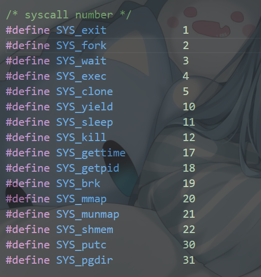
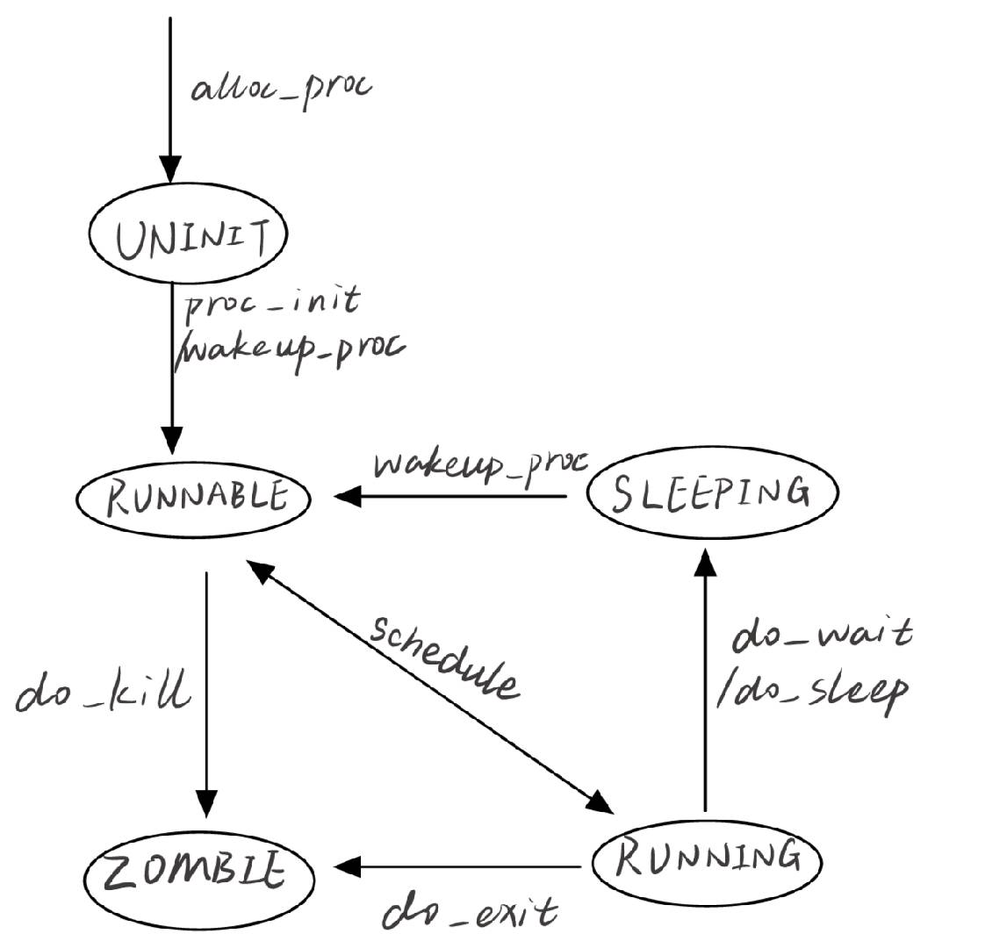

# **操作系统 Lab05 实验报告**

> 小组成员：武桐西 2112515、胡亚飞 2111690、王祺鹏 2110608

## 练习1: 加载应用程序并执行（需要编码）

> **do_execv** 函数调用`load_icode`（位于kern/process/proc.c中）来加载并解析一个处于内存中的ELF执行文件格式的应用程序。你需要补充`load_icode`的第6步，建立相应的用户内存空间来放置应用程序的代码段、数据段等，且要设置好`proc_struct`结构中的成员变量trapframe中的内容，确保在执行此进程后，能够从应用程序设定的起始执行地址开始执行。需设置正确的trapframe内容。

> 请在实验报告中简要说明你的设计实现过程。

在`do_execv`函数中，我们会将用户态的程序加载到内核态并执行，在这其中会调用`load_icode`函数加载并解析一个ELF格式的应用程序，给用户进程建立一个能正常运行的用户环境。

`load_icode`函数主要完成了以下工作：

1. 调用`mm_create`函数来申请进程的内存管理数据结构`mm`所需的内存空间，并对`mm`进行初始化；
2. 调用`setup_pgdir`函数来申请一个页目录表所需的一个页大小的内存空间，并把`boot_pgdir`所指的内核页表（描述ucore内核虚空间映射）的内容拷贝到这个新目录表中，最后让`mm->pgdir`指向这个页目录表；
3. 解析ELF格式的执行程序，并调用`mm_map`函数，根据ELF程序的各个段的起始位置和大小，建立对应的`vma`结构，并把其插入到`mm`结构中，表明这些是用户进程的合法用户态虚拟地址空间；接下来根据各个段的大小分配物理内存空间，在页表中建立好物理地址和虚拟地址的映射关系后，将各个段的内容拷贝到相应的内核虚拟地址中，最后初始化BSS段，将其清0；
4. 给用户进程设置用户栈，调用`mm_mmap`函数建立用户栈的`vma`结构；
5. 到这一步，`vma`和`mm`数据结构已经建立好，把`mm->pgdir`赋值给`cr3`寄存器，更新用户进程的虚拟内存空间。
6. 伪造中断返回线程，使得系统调用返回后可以正确跳转到需要运行的程序入口。设置`trapframe`，将 `gpr.sp`指向用户栈顶，将 `epc`设置为 ELF 文件的入口地址，设置 `sstatus`寄存器，表明已经进入用户模式。具体实现如下：

```C++
    struct trapframe *tf = current->tf;
    // Keep sstatus
    uintptr_t sstatus = tf->status;
    memset(tf, 0, sizeof(struct trapframe));
    /* LAB5:EXERCISE1 2112515、2111690、2110608
     * should set tf->gpr.sp, tf->epc, tf->status
     * NOTICE: If we set trapframe correctly, then the user level process can return to USER MODE from kernel. So
     *          tf->gpr.sp should be user stack top (the value of sp)
     *          tf->epc should be entry point of user program (the value of sepc)
     *          tf->status should be appropriate for user program (the value of sstatus)
     *          hint: check meaning of SPP, SPIE in SSTATUS, use them by SSTATUS_SPP, SSTATUS_SPIE(defined in risv.h)
     */
    tf->gpr.sp = USTACKTOP;     // 将gpr.sp指向用户栈顶
    tf->epc = elf->e_entry;     // 将epc设置为elf文件（用户程序）的入口地址
    /*
    用户模式(将SPP位清0，SPIE位置1) 
    SPP为0：User SPP为1：Supervisor
    SPIE置1，启用用户中断
    */
    // 设置status的值，表明退出当前中断后进入用户态
    tf->status = (sstatus & ~SSTATUS_SPP) | SSTATUS_SPIE; 
```

> 请简要描述这个用户态进程被ucore选择占用CPU执行（RUNNING态）到具体执行应用程序第一条指令的整个经过。

1. 首先调用`switch_to`进行上下文切换，保存当前寄存器状态到`context`中，将要执行的进程的`context`中的寄存器状态恢复到寄存器中；
2. 通过`ret`指令到`ra`寄存器指向的地址继续执行，由于之前已经设置了该地址为`fork_ret`函数的地址，所以会跳转到`forkret`函数中；
3. 进一步执行`Restore_ALL`，由于前面设置了`SSTATUS_SPP`位为0，不执行跳转，恢复`sstutus`和`sepc`以及通用寄存器；
4. 执行`sret`指令回到用户态，跳转到`sepc`指向的地址处（即ELF文件的入口点），从而执行用户程序的第一条指令。

## 练习2: 父进程复制自己的内存空间给子进程（需要编码）

> 创建子进程的函数`do_fork`在执行中将拷贝当前进程（即父进程）的用户内存地址空间中的合法内容到新进程中（子进程），完成内存资源的复制。具体是通过`copy_range`函数（位于kern/mm/pmm.c中）实现的，请补充`copy_range`的实现，确保能够正确执行。

> 请在实验报告中简要说明你的设计实现过程。

流程如下`do_fork->copy_mm->dup_mmap->copy_range`

在创建子进程的函数 `do_fork` 中，通过调用 `copy_mm` 函数实现了对用户内存地址空间的复制。`copy_mm` 函数中再调用 `dup_mmap`，而 `dup_mmap` 则调用了 `copy_range` 来复制进程 A 到进程 B 的地址空间。

以下是 `copy_range` 函数的简要设计实现过程：

这四行代码的作用是将父进程的物理页内容复制到子进程中，并在子进程的页表中建立新的物理页与虚拟页的映射关系。

1. `void src_kvaddr = page2kva(page);`：获取父进程的物理页 `page` 对应的内核虚拟地址。`page2kva` 是一个宏，用于获取给定物理页的内核虚拟地址。

    ```C++
    void* src_kvaddr = page2kva(page);
    ```

2. `void dst_kvaddr = page2kva(npage);`：获取子进程新分配的物理页 `npage` 对应的内核虚拟地址。同样使用 `page2kva` 宏。

    ```C++
    void* dst_kvaddr = page2kva(npage);
    ```

3. `memcpy(dst_kvaddr, src_kvaddr, PGSIZE);`：使用 `memcpy` 函数将父进程的物理页内容复制到子进程中。这里 `PGSIZE` 表示一页的大小，即复制整个页面的内容。

    ```C++
    memcpy(dst_kvaddr, src_kvaddr, PGSIZE);
    ```

4. `ret = page_insert(to, npage, start, perm);`： 在子进程的页表 `to` 中建立新的物理页 `npage` 与虚拟页的映射关系。`start` 表示虚拟地址的起始位置，`perm` 表示权限标志。

    ```C++
    ret = page_insert(to, npage, start, perm);
    ```

这四行代码一起完成了将父进程的用户空间中一个页面的内容复制到子进程的用户空间，并在子进程的页表中建立映射关系的操作。这是创建子进程时，复制用户空间内存内容的关键步骤。

```C++
void *src_kvaddr = page2kva(page);
// 找到子进程要被填充的物理页的内核虚拟地址  
void *dst_kvaddr = page2kva(npage);
// 将父进程的物理页的内容复制到子进程中
memcpy(dst_kvaddr, src_kvaddr, PGSIZE);
// 建立子进程的物理页与虚拟页的映射关系
ret = page_insert(to, npage, start, perm);
```

> 如何设计实现`Copy on Write`机制？给出概要设计，鼓励给出详细设计。

> Copy-on-write（简称COW）的基本概念是指如果有多个使用者对一个资源A（比如内存块）进行读操作，则每个使用者只需获得一个指向同一个资源A的指针，就可以该资源了。若某使用者需要对这个资源A进行写操作，系统会对该资源进行拷贝操作，从而使得该“写操作”使用者获得一个该资源A的“私有”拷贝—资源B，可对资源B进行写操作。该“写操作”使用者对资源B的改变对于其他的使用者而言是不可见的，因为其他使用者看到的还是资源A。

Copy-on-Write机制的主要思想为使得进程执行 fork 系统调用进行复制的时候，父进程不会简单地将整个内存中的内容复制给子进程，而是暂时共享相同的物理内存页；而当其中一个进程需要对内存进行修改的时候，再额外创建一个自己私有的物理内存页，将共享的内容复制过去，然后在自己的内存页中进行修改。

因此，可以主要修改两个部分：

1. 进行 fork 操作的时候不直接复制内存；
2. 在出现了内存页访问异常的时候，将共享的内存页复制一份，然后在新的内存页进行修改。

具体实现见**Challenge1**。

## 练习3: 阅读分析源代码，理解进程执行 fork/exec/wait/exit 的实现，以及系统调用的实现（不需要编码）

> 请在实验报告中简要说明你对 fork/exec/wait/exit 函数的分析。并回答如下问题：

> 请分析fork/exec/wait/exit的执行流程。重点关注哪些操作是在用户态完成，哪些是在内核态完成？内核态与用户态程序是如何交错执行的？内核态执行结果是如何返回给用户程序的？

### 系统调用执行流程 Overview

以 X 代替某系统调用，系统调用的执行流程如下：

1. 用户程序中调用 `X()` （`user/libs/ulib.c`中）

2. `sys_X()` （`user/libs/syscall.c`中）

3. `syscall(SYSCALL_NUM, ...)` （`user/libs/syscall.c`中）
   
   `SYSCALL_NUM` 位于 `libs/unistd.h` 中
   
   
   
4. 内联汇编 `ecall`

5. 至此，由**用户态**进入到**内核态**。异常捕获 -> `CAUSE_USER_ECALL` -> `syscall()` （位于`kern/syscall/syscall.c`）

6. `syscall()` 中根据 `SYSCALL` 代码区分不同系统调用，通过函数指针（数组）实现不同的系统调用 `sys_X()`

7. 调用 `do_X()` （位于`kern/process/proc.c`中）

**总体流程**

用户态：`X()` -> `sys_X()` -> `syscall(SYSCALL_NUM, ...)` -> `ecall` -> 进入**内核态**

内核态：异常捕获 `syscall()` -> 函数指针调用对应的 `sys_X()` -> `do_X()`

**注意**：`exec` 略有区别

在内核态：`kernel_execve()` -> `ebreak`（设置 `a7` <- `10`） -> `syscall()` -> `sys_exec()` -> `do_execve()` -> `load_icode()`

### fork

fork将创建新的子线程，将子线程的状态由`UNINIT`态变为`RUNNABLE`态，不改变父进程的状态。

用户态执行流程：

`fork()` -> `sys_fork()` -> `syscall(SYS_fork)` -> `ecall`

内核态执行流程：

`syscall()` -> `sys_fork()` -> `do_fork()`

`do_fork`函数的主要工作：

1. 分配并初始化进程控制块（ `alloc_proc`函数）;
2. 分配并初始化内核栈，为内核进程（线程）建立栈空间（ `setup_stack `函数）;
3. 根据 `clone_flag `标志复制或共享进程内存管理结构（ `copy_mm `函数）;
4. 设置进程正常运行和调度所需的中断帧和执行上下文 （` copy_thread `函数）;
5. 为进程分配一个 PID（` get_pid()` 函数）;
6. 把设置好的进程控制块放入 `hash_list` 和 `proc_list `两个全局进程链表中;
7. 唤醒进程，把进程状态设置为"`RUNNABLE`"态;
8. 设置返回码为子进程的 PID 号。

### exec

exec完成用户进程的创建工作，同时使用户进程进入执行，不改变进程状态。

内核态执行流程：

`kernel_execve()` -> `ebreak -> syscall()` -> `sys_exec()` -> `do_execve()` -> `load_icode()`

当应用程序执行的时候，会调用 `sys_exec`系统调用，而当`ucore`收到此系统调用的时候，则会使用 `do_execve()`函数来实现。

`do_execve`函数的主要工作：

1. 为加载新的执行码做好用户态内存空间清空准备。如果 mm 不为 NULL，说明当前进程占用了内存，要进行清理：
   1. 设置页表为内核空间页表，释放进程的内存映射；
   2. 进一步判断 mm 的引用计数减 1 后是否为 0，如果为 0，则表明没有进程再需要此进程所占用的内存空间；
   3. 根据 mm 中的记录，释放进程所占用户空间内存和进程页表本身所占空间；
   4. 最后把当前进程的 mm 内存管理指针为空。
2. 调用 `load_icode`从而使之准备好执行。（`load_icode`具体功能见练习一）。

### wait

wait完成子进程资源回收，如果有已经结束的子进程或者没有子进程，那么调用会立刻结束，不影响进程状态；否则，进程需要等待子进程结束，进程从`RUNNING`态变为`SLEEPING`态。

用户态执行流程：

`wait()` -> s`ys_wait()` -> `syscall(SYS_wait)` -> `ecall()`

内核态执行流程：

`syscall()` -> `sys_wait()` -> `do_wait()`

`do_wait`函数的主要工作：

1. 检查`code_store`，如果`code_store`不为空，则使用`user_mem_check`检查，保证这个地址在用户空间并且可写；
2. 如果`pid!=0`，表示只找一个进程 id 号为 `pid`的退出状态的子进程，否则找任意一个处于退出状态的子进程;
3. 如果此子进程的执行状态不为 `PROC_ZOMBIE`，表明此子进程还没有退出，则当前进程设置执行状态为 `PROC_SLEEPING`（睡眠），睡眠原因为 `WT_CHILD`(即等待子进程退出)，调用 `schedule()` 函数选择新的进程执行，自己睡眠等待，如果被唤醒，则重复跳回步骤 2处执行;
4. 如果此子进程的执行状态为 `PROC_ZOMBIE`，表明此子进程处于退出状态，需要当前进程(即子进程的父进程)完成对子进程的最终回收工作，即首先把子进程控制块从两个进程队列 `proc_list `和 `hash_list `中删除，并释放子进程的内核堆栈和进程控制块。
5. 至此，子进程彻底地结束了其执行过程，所占用的所有资源均已释放。

### exit

exit完成对资源的回收，进程从`RUNNING`态变为`ZOMBIE`态。

用户态执行流程：

`exit()` -> `sys_exit()` -> `syscall(SYS_exit)` -> `ecall`

内核态执行流程：

`syscall()` -> `sys_exit()` -> `do_exit()`

`do_exit`函数的主要工作：

1. 首先对当前进程 `current`进行判断，判断其是否 `idleproc` 或 `initproc`，若是则发出 `panic`；
2. 随后获取当前进程的内存管理结构`mm`；
3. 若`mm`不为空，说明是用户进程；若是，则切换到内核页表，确保接下来的操作在内核空间执行，如果`mm`引用计数减到`0`，说明没有其他进程共享此`mm`，此时可以释放用户虚拟内存空间相关的资源，将当前进程的`mm`设置为`NULL`，表示资源已经释放。
4. 至此，`mm`已为`NULL`，将进程状态设置为`PROC_ZOMBIE`，表示进程已退出；
5. 在进行后续操作前，首先关闭中断；
6. 唤醒父进程（`wakeup_proc(parent)`）;
7. 遍历当前进程的所有子进程，然后更新相关的进程指针；
8. 设置子进程的父进程为`initproc`，并加入`initproc`的子进程链表，如果子进程也处于退出状态，唤醒`initproc`；
9. 开启中断；
10. 最后，调用调度器执行调度。

> 请给出ucore中一个用户态进程的执行状态生命周期图（包执行状态，执行状态之间的变换关系，以及产生变换的事件或函数调用）。（字符方式画即可）



## 扩展练习 Challenge

### `Copy on Write`机制实现

根据上面的设计，我们主要修改两个部分：

- do fork 部分：在进行内存复制的部分，比如 copy_range 函数内部，不实际进行内存的复制，而是将子进程和父进程的虚拟页映射上同一个物理页面，然后在分别在这两个进程的虚拟页对应的 PTE 部分将这个页置成是不可写的，同时利用 PTE 中的保留位将这个页设置成共享的页面，这样的话如果应用程序试图写某一个共享页就会产生页访问异常，从而可以将控制权交给操作系统进行处理。
- page fault 部分：在 page fault 的 ISR 部分，增加对当前的异常进行判断是否由于尝试写了某一个共享页面引起的，如果是的话，额外申请分配一个物理页面，然后将当前的共享页的内容复制过去，并建立出错的线性地址与新创建的物理页面的映射关系，将 PTE 设置设置成非共享的，然后查询原先共享的物理页面是否还是由多个其它进程共享使用的；如果不是的话，就将对应的虚地址的 PTE 进行修改，删掉共享标记，恢复写标记；这样的话 page fault 返回之后就可以正常完成对虚拟内存的写操作了。

具体修改如下：

#### 设置共享标志

在 `vmm.c `中将 `dup_mmap `中的 `share `变量的值改为 1，启用共享：

```C++
int dup_mmap(struct mm_struct *to, struct mm_struct *from) {
                ...
        bool share = 1;
                ...
}
```

#### **映射共享页面**

在 `pmm.c` 中为 `copy_range `添加对共享的处理，如果 `share`为 1，那么将子进程的页面映射到父进程的页面。由于两个进程共享一个页面之后，无论任何一个进程修改页面，都会影响另外一个页面，所以需要子进程和父进程对于这个共享页面都保持只读。

```C++
int copy_range(pde_t *to, pde_t *from, uintptr_t start, uintptr_t end, bool share) {
        ...
        if (*ptep & PTE_P) {
            if ((nptep = get_pte(to, start, 1)) == NULL) {
                return -E_NO_MEM;
            }
            uint32_t perm = (*ptep & PTE_USER);
            //get page from ptep
            struct Page *page = pte2page(*ptep);
            assert(page!=NULL);
            int ret=0;
            if (share) {        
                // share page
                page_insert(from, page, start, perm & (~PTE_W));
                ret = page_insert(to, page, start, perm & (~PTE_W));
            } else {
                // alloc a page for process B
                struct Page *npage=alloc_page();
                assert(npage!=NULL);
                uintptr_t src_kvaddr = page2kva(page);
                uintptr_t dst_kvaddr = page2kva(npage);
                memcpy(dst_kvaddr, src_kvaddr, PGSIZE);
                ret = page_insert(to, npage, start, perm);
            }
            assert(ret == 0);
        }
                ...
    return 0;
}
```

#### 在修改时拷贝

当程序尝试修改只读的内存页面的时候，将触发Page Fault中断，在错误代码中 P=1，W/R=1。因此，当错误代码最低两位都为 1 的时候，说明进程访问了共享的页面，内核需要重新分配页面、拷贝页面内容、建立映射关系。

在`vmm.c`的`do_pgfault`函数中添加如下代码：

```C++
 int do_pgfault(struct mm_struct *mm, uint32_t error_code, uintptr_t addr) {
        ...
    if (*ptep == 0) {
        ...
    } else if (error_code & 3 == 3) {        // copy on writestruct Page *page = pte2page(*ptep);
        struct Page *npage = pgdir_alloc_page(mm->pgdir, addr, perm);
        uintptr_t src_kvaddr = page2kva(page);
        uintptr_t dst_kvaddr = page2kva(npage);
        memcpy(dst_kvaddr, src_kvaddr, PGSIZE);
    } else {
                ...
           }
        ...
}
```

### 说明该用户程序是何时被预先加载到内存中的？与我们常用操作系统的加载有何区别，原因是什么？

在本次实验中，用户程序在编译时被链接到内核中，并定义好了起始位置和大小，然后在`user_main()`函数`KERNEL_EXECVE`宏调用 `kernel_execve` 函数，从而调用 `load_icode`函数将用户程序加载到内存中。

而在我们常用的操作系统中，用户程序通常是存储在外部存储设备上的独立文件。当需要执行某个程序时，操作系统会从磁盘等存储介质上动态地加载这个程序到内存中。

其实，主要原因是 ucore 未实现硬盘，为了简化处理，将用户程序直接编译到内核中。

## 一些思考

在 `kern/process/proc.c` 中的 `do_execve` 函数中，如果 `set_proc_name `的实现不变, 为什么不能直接 `set_proc_name(current, name)` ?

在这段代码中，`set_proc_name(current, local_name);` 使用了一个局部变量 `local_name`，而不是直接使用 `name` 参数，主要有两个原因：

1. 长度限制：`PROC_NAME_LEN` 是进程名的最大长度。如果 `name` 的长度超过 `PROC_NAME_LEN`，那么 `set_proc_name` 可能会导致缓冲区溢出。为了避免这个问题，代码先将 `name` 复制到 `local_name`，并确保 `local_name` 的长度不超过 `PROC_NAME_LEN`。
2. 需要检查该段内存空间是否可用（调用 `user_mem_check` ）

所以，即使 `set_proc_name` 的实现不变，也不能直接使用 `set_proc_name(current, name);`。
